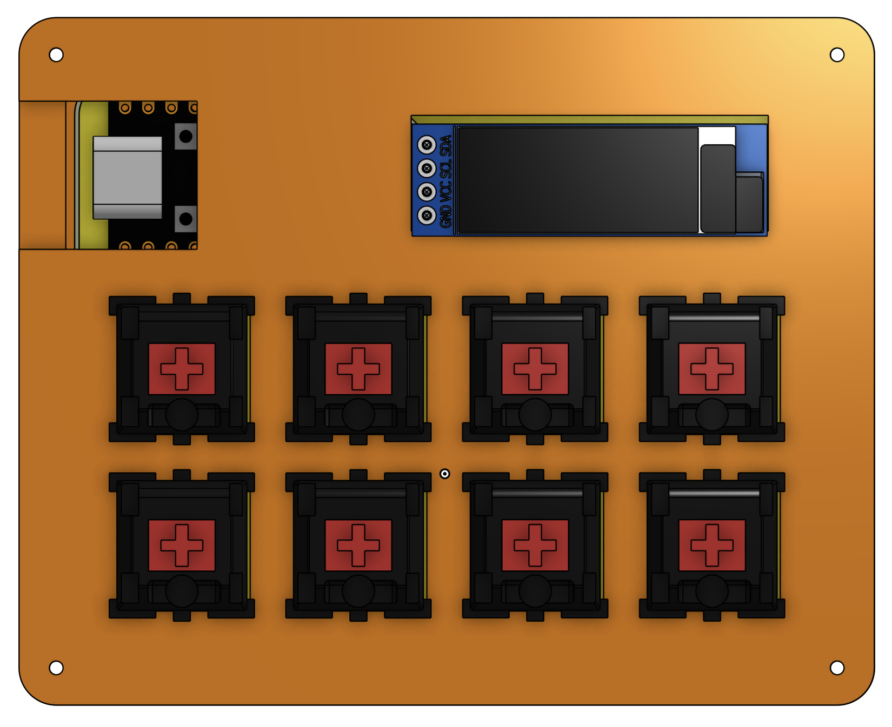
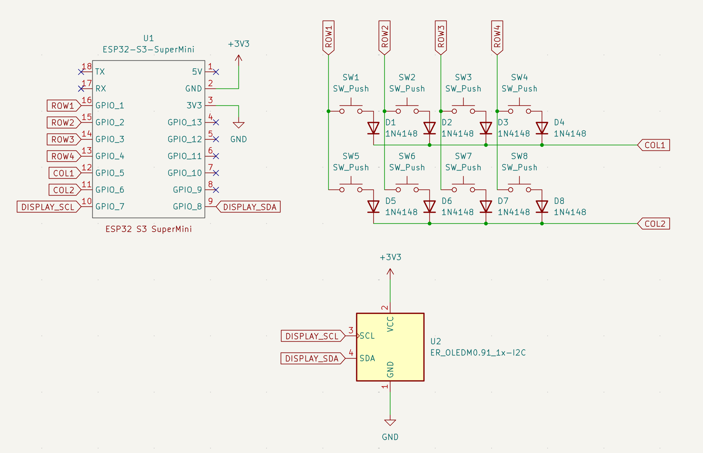
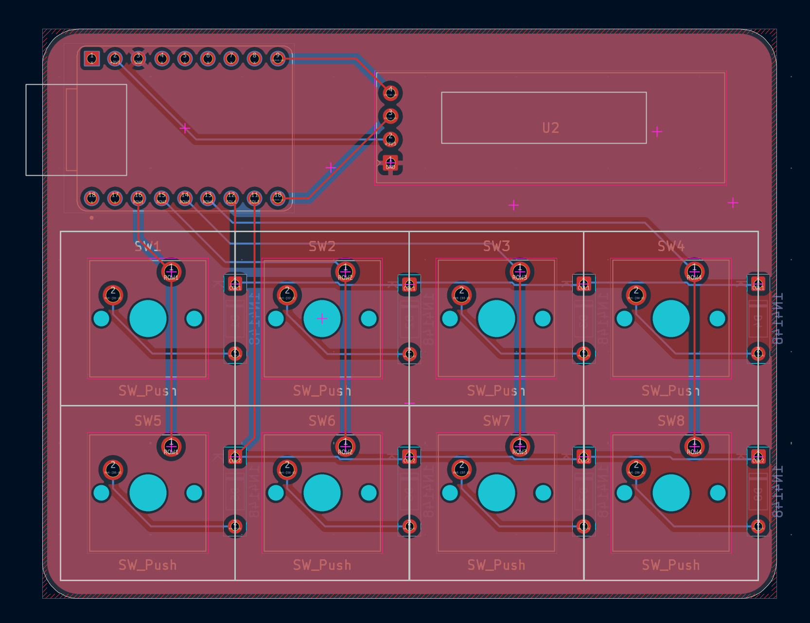
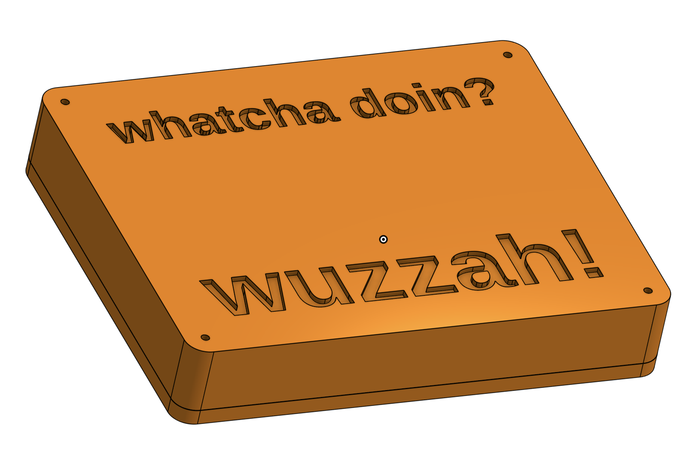
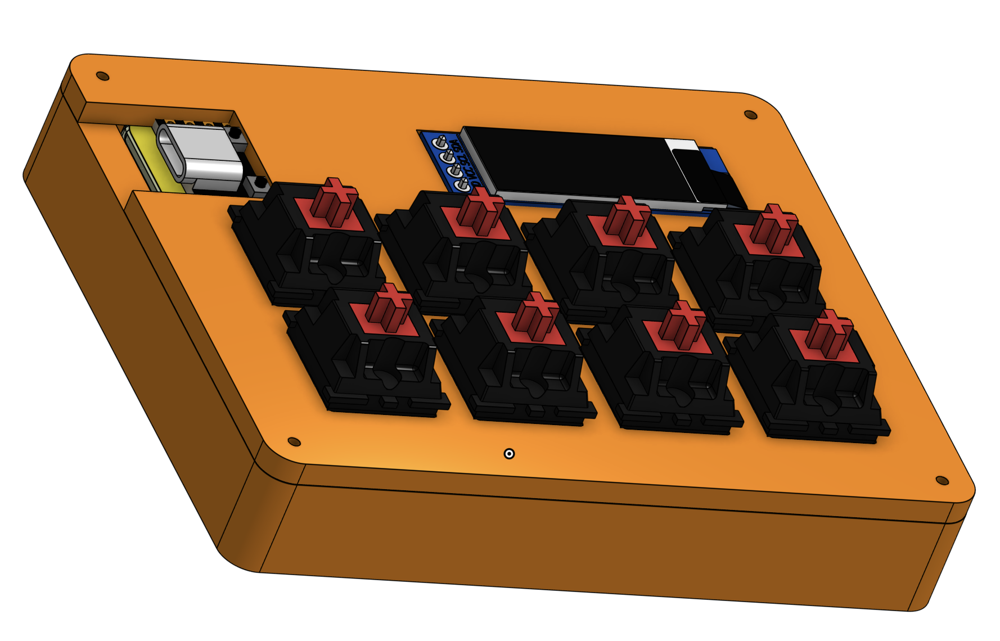

# macropad

### Why did I make it?
bcz i need more hardware projects in my portfolio and also because it seemed like a fun hardware project which was kinda beginner friendly.

### What was the hardest part about this ?
honestly speaking, CAD.

Features:

- 8 Remappable Key Matrix for anything!
- ESP32C3 SuperMini as the main brain
- Custom PCB Art (really cool)
- Custom case

### Schematic

### PCB 

### Case

### 3D view of all parts 

link to full 3d thing-
https://cad.onshape.com/documents/f3f4d199ef23d310b3ca664c/w/34908b541132c21f4c70cc87/e/ea0e0a44c36532055dd3e013?renderMode=0&uiState=6ac56a265213d46a6705e1a3

## BOM

[BOM](BOM.csv)
|Name                           |Purpose                         |Quantity|Total Cost (USD)|Link                                                                                 |Distributor    |
|-------------------------------|--------------------------------|--------|----------------|-------------------------------------------------------------------------------------|---------------|
|ESP32-S3 SuperMini             |Main MCU                        |1       |7.4             |https://www.amazon.in/gp/product/B0H8YMNKHL                                          |Amazon         |
|Switches for Transmitter       |Switches for controlling the car|8       |0               |SELF SOURCED                                                                         |SELF SOURCED   |
|Keycaps for the switches       |Keycaps of the switches         |8       |0               |SELF SOURCED                                                                         |SELF SOURCED   |
|0.91 inch display              |Display                         |1       |2.2             |https://robu.in/product/0-91-inch-128x32-i2c-iic-serial-blue-oled-lcd-display-module/|Robu           |
|Case 3D Printed                |Case for the entire macropad    |1       |0               |Printing Legion                                                                      |Printing Legion|
|PCB of Transmitter AND Receiver|Main PCBs                       |5       |13.82           |https://jlcpcb.com/                                                                  |JLPCB          |
|                               |                                |        |                |                                                                                     |               |
|                               |                                |        |23.42           |                                                                                     |               |

## Total Pricing

Final Price comes out to be 5,430 INR ($57.1) [ SHIPPING INCLUDED ]

The pricing might slightly vary due to flash sales, and dollar market trends.